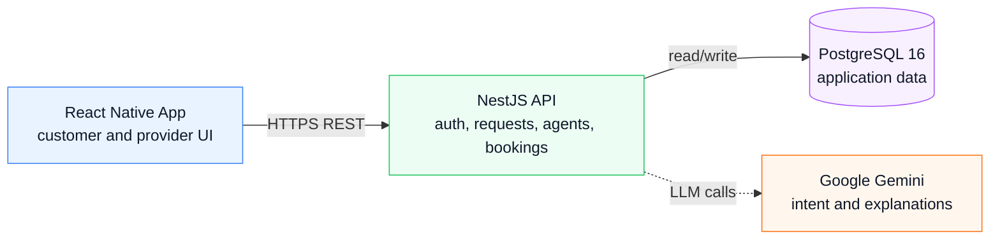
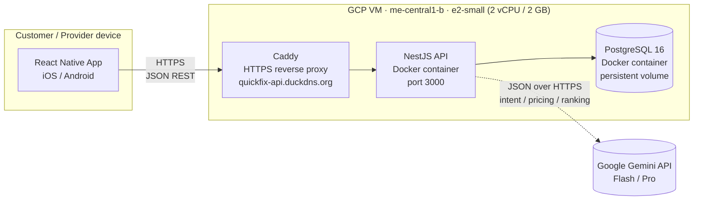
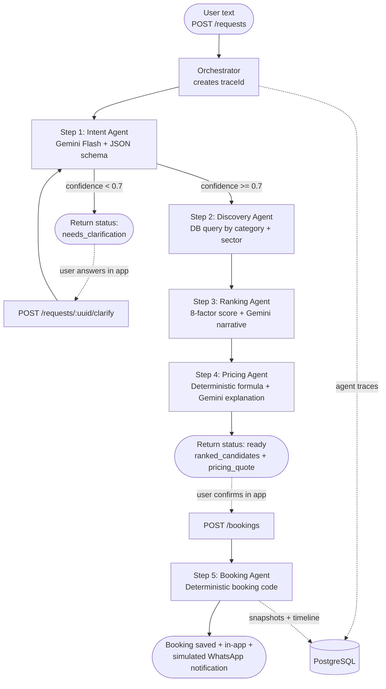

# QuickFix

AI Service Orchestrator for Pakistan's informal service economy.

**Google Antigravity Hackathon - Challenge 2**

QuickFix helps a customer describe a home-service problem in natural language, understand what is needed, rank nearby technicians/providers, produce a fair quote, confirm a booking and manage bookings.

Production backend: `https://quickfix-api.duckdns.org/api/v1`  
VM public IP: `34.18.63.20`  
Repository: https://github.com/Nehal409/quick-fix-api (backend, mobile app, and infra live in this single repo)

## Team

| Member | GitHub |
|---|---|
| Nehal Nasir Khan | https://github.com/Nehal409 |
| Tanzeel Khan | https://github.com/Tanzeel-khan |
| Owais Ali Shah | https://github.com/syedowaisalishah |
| Zahid Khan | https://github.com/zahidkhan-xen |

## What We Built

QuickFix contains three main pieces:

| Layer | Implementation |
|---|---|
| Mobile frontend | React Native app for customers and providers |
| Backend API | NestJS + TypeScript REST API |
| Database and deployment | PostgreSQL 16 and backend deployed on a Google Cloud VM |

The end-to-end flow is:

1. Customer signs up or logs in.
2. Customer enters a free-form service request such as Roman Urdu, Urdu, or English.
3. The intent agent extracts service type, urgency, budget, location, timing, and missing fields.
4. If the request is ambiguous, the API returns clarification questions for the React Native app.
5. The discovery and ranking agents shortlist providers.
6. The pricing agent generates a transparent PKR quote and explanation.
7. Customer confirms a booking.
8. Provider can view jobs and move the booking through status updates. Either party can cancel. The cancellation records the status change and sends a notification.
9. Notifications are stored in-app, including a simulated WhatsApp confirmation message.
10. Users can view agent trace logs and reasoning for each request — every pipeline run records a `traceId`, per-agent trace entries (latency, model, tokens), and a "How I decided" view explaining the ranked provider.

## Architecture



The backend is modular rather than a single large controller. Request handling lives in `RequestsModule`, booking lifecycle in `BookingsModule`, and agent orchestration in `AgentsModule`. Deterministic services are used for matching and pricing so the core business logic is inspectable and reproducible, while Gemini is used where language understanding or user-facing explanations are valuable.

### Deployment & Runtime Flow

End-to-end path of a customer request, from mobile device to database, including the deployment topology on the GCP VM:



Notes:

- The three production containers (`caddy`, `app`, `db`) are orchestrated by `docker-compose.prod.yml` on a single VM.
- TLS termination happens at Caddy; the API and database listen only on the internal Docker network.
- Gemini is the only external dependency on the hot path; all other state is local to the VM.

## Agent Design

| Agent | Purpose | Implementation |
|---|---|---|
| Intent Agent | Parses raw user text into structured service intent, urgency, budget, location, time, and clarification questions | Gemini Flash with JSON schema validation |
| Discovery Agent | Finds candidate providers by service category, sector, city, and active status | Deterministic database query and scoring pre-pass |
| Ranking Agent | Ranks providers with factor-level reasoning | Deterministic scoring plus optional Gemini explanation for one provider |
| Pricing Agent | Builds quote, fairness band, and customer-friendly explanation | Deterministic pricing formula plus Gemini Flash narrative fallback |
| Booking Agent | Creates booking draft, booking code, snapshots, timeline, and simulated WhatsApp text | Deterministic agent |
| Orchestrator | Creates trace IDs and records per-agent traces | NestJS service |

The hot path uses fast, bounded outputs. Intent and pricing use Gemini with response schemas and validation. Ranking is mostly deterministic so the selected provider can be explained and audited rather than being a black-box LLM choice.

### Agentic Pipeline Flow

The diagram below shows what is actually implemented in [src/modules/agents/](src/modules/agents/). Clarification and booking confirmation each cross an HTTP boundary — the orchestrator returns and the client makes a fresh request to resume.



## Matching and Pricing Logic

Provider ranking uses eight weighted factors:

| Factor | Weight |
|---|---:|
| Service specialization match | 0.22 |
| On-time score | 0.18 |
| Distance / travel time | 0.16 |
| Cancellation rate | 0.12 |
| Review recency | 0.10 |
| Capacity in requested window | 0.10 |
| Budget fit | 0.07 |
| Price per visit | 0.05 |

Pricing is computed with:

- Provider visit fee
- Estimated travel cost
- Service complexity
- Urgency adjustment
- Loyalty discount placeholder
- Demand surge signal
- Fairness band based on peer provider prices

The pricing engine applies a demand-surge signal when a service category is in a high-demand window (for example, cooling/HVAC during heatwaves, plumbing during monsoon, generator repair during load-shedding spikes) so quotes reflect real market pressure. Distance is currently estimated from sector proximity.

## Antigravity in This Project

Google Antigravity was the primary AI coding environment used to build QuickFix during the hackathon. The repository carries a checked-in [.antigravity/](.antigravity/) directory of context files that Antigravity loaded before every change, so the model had consistent project knowledge across sessions and team members.

| Context file | What Antigravity uses it for |
|---|---|
| [project.md](.antigravity/project.md) | Project identity, tech stack, env vars, source layout |
| [architecture.md](.antigravity/architecture.md) | Module map, request lifecycle, layering rules |
| [agents.md](.antigravity/agents.md) | Agent pipeline, prompts, schemas, orchestration contract |
| [api.md](.antigravity/api.md) | REST surface, DTO conventions, status codes |
| [domain.md](.antigravity/domain.md) | Service categories, sectors, ranking factors, pricing inputs |
| [rules.md](.antigravity/rules.md) | Non-negotiable coding rules (strict TS, DTOs, migrations, no console.log) |
| [module-scaffold.md](.antigravity/module-scaffold.md) | Template for new feature modules |
| [docker.md](.antigravity/docker.md) | Compose, Dockerfile, and entrypoint conventions |
| [commands.md](.antigravity/commands.md) | npm scripts, migration commands, seeding |
| [common.md](.antigravity/common.md) | Shared filters, guards, interceptors |
| [build-status.md](.antigravity/build-status.md) | Day-by-day hackathon build progress |

How Antigravity contributed to the actual build:

- **Module scaffolding** — `auth`, `users`, `requests`, `providers`, `matching`, `pricing`, `bookings`, `notifications`, and `agents` modules were generated against the `module-scaffold.md` template, then hand-edited.
- **Agent prompt iteration** — Intent and pricing prompts, JSON response schemas, and clarification flows were drafted and refined inside Antigravity with `agents.md` as ground truth.
- **TypeORM migrations** — Entity changes were turned into migrations through Antigravity, then reviewed and committed.
- **Cross-file refactors** — Renames, DTO updates, and Swagger annotations applied consistently across modules without losing context between turns.
- **Documentation** — This README, the API surface table, and the architecture diagram were produced with Antigravity reading the actual code, not a stale spec.

The `.antigravity/` files are versioned with the code so the context evolves with the project rather than living in chat history.

## APIs and Tools Used

| Category | Tool/API | Usage |
|---|---|---|
| LLM | Google Gemini via `@google/genai` | Intent extraction, structured JSON generation, pricing/ranking explanations |
| Backend framework | NestJS | REST API, modules, guards, validation, Swagger |
| Database | PostgreSQL 16 | Users, providers, requests, bookings, notifications |
| ORM | TypeORM | Entities, repositories, migrations |
| Auth | JWT + bcryptjs | Email/password auth and role-based access |
| Mobile | React Native | Customer/provider mobile experience |
| Deployment | Google Cloud VM, Docker Compose, Caddy | Backend, database, reverse proxy, HTTPS/domain routing |
| Documentation | Swagger/OpenAPI | Local API exploration in non-production mode |
| AI coding environment | Google Antigravity | Used during hackathon development for planning, code navigation, implementation support, and fast iteration |

## Real vs Mocked Integrations

| Integration | Status | Notes |
|---|---|---|
| Gemini API | Real | Requires `GEMINI_API_KEY` |
| PostgreSQL | Real | Runs in Docker locally and on the GCP VM |
| Provider marketplace | Mock/demo data | Seeded provider pool across multiple informal-economy service categories |
| WhatsApp | Simulated | Confirmation text is generated and stored as an in-app notification |
| Google Maps | Configured placeholder | API key exists in config, but distance currently uses sector heuristic |
| Payments | Not implemented | Payment method is stored as cash for the demo |
| Push notifications | Not implemented | Notifications are retrieved through API polling |

## Backend API Surface

All endpoints are under `/api/v1`.

| Method | Endpoint | Description |
|---|---|---|
| `POST` | `/auth/register` | Register customer or provider |
| `POST` | `/auth/login` | Login and receive JWT |
| `GET` | `/users/me` | Get current user profile |
| `PATCH` | `/users/me` | Update profile |
| `POST` | `/requests` | Run intent, discovery, ranking, and pricing pipeline |
| `POST` | `/requests/:uuid/clarify` | Continue a request after answering clarification questions |
| `GET` | `/requests/:uuid/candidates/:providerUuid/reasoning` | Explain why a provider was ranked |
| `GET` | `/requests/:uuid/chat` | Return request conversation context |
| `POST` | `/bookings` | Confirm booking from a ready request |
| `GET` | `/bookings` | List bookings for current customer/provider |
| `GET` | `/bookings/:uuid` | Get booking detail |
| `PATCH` | `/bookings/:uuid/status` | Provider updates booking status |
| `POST` | `/bookings/:uuid/cancel` | Customer/provider cancels booking |
| `GET` | `/notifications` | List in-app notifications |
| `POST` | `/notifications/:uuid/read` | Mark notification as read |

Swagger is available locally at `http://localhost:3000/api/v1/docs` when `NODE_ENV` is not `production`.

### Agent traces

There is no separate trace endpoint. Trace data surfaces through the existing request endpoints:

- `POST /requests` and `POST /requests/:uuid/clarify` return a `traceId` plus per-agent trace entries (model, latency, token usage).
- `GET /requests/:uuid/candidates/:providerUuid/reasoning` returns the ranking factors and the Gemini narrative explaining a specific provider.
- `GET /requests/:uuid/chat` returns the full request conversation context including clarification rounds.

## Try It (For Judges)

Production API base URL:

```
https://quickfix-api.duckdns.org/api/v1
```

### Demo accounts

| Role | Email | Password |
|---|---|---|
| Customer | `demo@example.com` | `thisPass123` |
| Provider | `ali.khan@quickfix.demo` | `provider123` |

> These accounts are pre-seeded for the hackathon demo. You can also register a fresh customer via `POST /auth/register`.

## Frontend Overview

The frontend is a React Native mobile app that lives in this same repository (see the `mobile/` folder) and consumes the REST API.

### Screens

- Auth screens for customer/provider login and registration.
- Natural language service request screen.
- Clarification UI for missing time/location/budget fields.
- Candidate provider list with match score, ETA, rating, and quote.
- "How I decided" reasoning view powered by backend factor outputs.
- Agent trace view that shows the per-agent reasoning recorded against the request's `trace_id`.
- Booking confirmation and tracking screen.
- Provider booking list and status update flow.
- Notification inbox for booking confirmations, status updates, cancellations, and simulated WhatsApp messages.

### Architecture choices

- API state is kept separate from presentation state; the backend remains the source of truth for ranking, pricing, booking status, and notifications.
- JWT is stored on-device and attached as `Authorization: Bearer <token>` to protected requests.
- The mobile app does not duplicate ranking or pricing logic; it renders structured fields (`ranked_candidates`, `pricing_quote`, `status_timeline`) returned by the API.

### Run the mobile app

The mobile app folder ships its own README with full setup instructions. The short version:

```bash
cd mobile
npm install
# Point the app at the deployed API (or your local backend)
export EXPO_PUBLIC_API_BASE_URL=https://quickfix-api.duckdns.org/api/v1
npm run start
```

For a local backend, set `EXPO_PUBLIC_API_BASE_URL=http://<your-lan-ip>:3000/api/v1` and ensure the device/emulator can reach that host.

## Deployment

The backend and database are deployed on a Google Cloud VM:

| Item | Value |
|---|---|
| Cloud | Google Cloud Platform |
| Zone | `me-central1-b` |
| Machine type | `e2-small` |
| Resources | 2 vCPUs, 2 GB memory |
| Public IP | `34.18.63.20` |
| Domain | `quickfix-api.duckdns.org` |
| Reverse proxy | Caddy |
| Runtime | Docker Compose |
| Database | PostgreSQL 16 container with persistent volume |

Production compose services:

- `app`: NestJS backend container.
- `db`: PostgreSQL 16 Alpine container.
- `caddy`: Reverse proxy from `quickfix-api.duckdns.org` to `app:3000`.

The Caddyfile is intentionally small:

```caddy
quickfix-api.duckdns.org {
    reverse_proxy app:3000
}
```

## Local Setup

### Prerequisites

- Node.js 24 recommended
- Docker and Docker Compose

### Install dependencies

```bash
npm install
```

### Configure environment

Create `.env`:

```bash
cp .env.sample .env
```

Required variables:

| Variable | Description |
|---|---|
| `PORT` | API port, defaults to `3000` |
| `PG_HOST` | PostgreSQL host |
| `PG_PORT` | PostgreSQL port |
| `PG_USER` | PostgreSQL user |
| `PG_PASSWORD` | PostgreSQL password |
| `PG_DATABASE` | PostgreSQL database |
| `JWT_SECRET` | Secret used to sign JWTs |
| `JWT_EXPIRES_IN` | Token lifetime, defaults to `7d` |
| `GEMINI_API_KEY` | Google Gemini API key |
| `GEMINI_FLASH_MODEL` | Defaults to `gemini-2.0-flash` |
| `GEMINI_PRO_MODEL` | Defaults to `gemini-2.5-pro` |
| `GEMINI_TIMEOUT_MS` | Gemini timeout, defaults to `15000` |
| `GEMINI_MAX_RETRIES` | Gemini retry count, defaults to `2` |
| `GOOGLE_MAPS_API_KEY` | Reserved for future Maps integration |

### Run with Docker Compose

```bash
docker compose up --build
```

This starts the API and PostgreSQL. The container entrypoint waits for PostgreSQL and runs migrations before starting the app.

### Run locally

```bash
docker compose up db -d
npm run migrate:run
npm run seed
npm run start:dev
```

API: `http://localhost:3000/api/v1`  
Swagger: `http://localhost:3000/api/v1/docs`

## Database Commands

```bash
npm run migrate:run
npm run migrate:revert
npm run migrate:generate -- database/migrations/MigrationName
npm run seed
```

Use `npm run schema:drop` only for local demo resets because it destroys all database tables.

## Testing and Quality

```bash
npm run lint
npm run test
npm run test:e2e
npm run build
```

For the hackathon submission, the most important manual test path is:

1. Register/login as a customer.
2. Create a service request.
3. Answer any clarification question.
4. Inspect ranked candidates and quote.
5. Confirm booking.
6. Open booking detail.
7. Update provider status or cancel booking.
8. Check notifications.

## Cost and Latency

The design keeps expensive calls out of deterministic business logic:

- Gemini is used only for language extraction and short explanations.
- Matching, pricing, booking code generation, and status transitions are deterministic.
- The main request pipeline uses Gemini Flash to reduce latency.
- The API stores structured results so the mobile app can re-render details without rerunning agents.

Expected cost drivers:

- Gemini token usage for service requests and explanations.
- VM uptime.
- PostgreSQL disk storage.
- Future Google Maps Distance Matrix calls if enabled.
- Future SMS/WhatsApp/push notification delivery.

Expected latency drivers:

- One Gemini call for intent extraction.
- Optional Gemini call for pricing explanation.
- Database reads for providers and bookings.
- Network latency between mobile app, VM, and Gemini API.

## Scalability Plan

The current VM deployment is appropriate for a hackathon demo. To scale beyond it:

- Move PostgreSQL to Cloud SQL or another managed database.
- Run the API on Cloud Run, GKE, or a VM group with health checks.
- Add Redis for caching provider search, distance estimates, and request traces.
- Add background jobs for reminders, push notifications, and provider follow-up.
- Replace sector-distance heuristic with cached Google Distance Matrix results.
- Add pagination and indexes for provider search and booking lists.
- Add observability with metrics, tracing, structured logs, and alerting.

## Baseline Comparison

| Baseline Manual Flow | QuickFix Flow |
|---|---|
| Customer calls multiple technicians manually | Customer describes the problem once |
| Provider selection is based on memory or random contacts | Providers are ranked by specialization, distance, reliability, budget, and pricing |
| Price is negotiated without transparency | Quote includes line-item explanation and fairness range |
| Roman Urdu/Urdu requests are handled informally | Intent agent supports English, Urdu, and Roman Urdu input |
| Booking confirmation happens over phone/chat only | Booking record, timeline, notifications, and simulated WhatsApp message are generated |
| No audit trail for why a provider was chosen | Ranking factors and agent traces make decisions explainable |

## Assumptions

- Demo domain covers common informal-economy home services in Pakistan (e.g. AC, plumbing, electrical, appliance repair, cleaning); the architecture is service-category agnostic and adding a new category is a data/config change, not a code change.
- Provider data is seeded/mock data, not a live marketplace.
- Customers and providers use the mobile app as the main interface.
- Payments happen outside the app as cash.
- One booking maps to one service request and one selected provider.
- Location is currently city/sector based rather than exact GPS.
- Notifications are in-app/polling based during the hackathon build.

## Limitations

- Google Maps Distance Matrix is not yet active; distance and ETA are sector heuristics.
- WhatsApp integration is simulated, not sent through the official WhatsApp Business API.
- Reviews and feedback are represented through provider summary fields rather than a full reviews table.
- No real payment gateway is integrated.
- The production deployment runs on a single small VM, so it is not highly available.
- Swagger docs are disabled in production.
